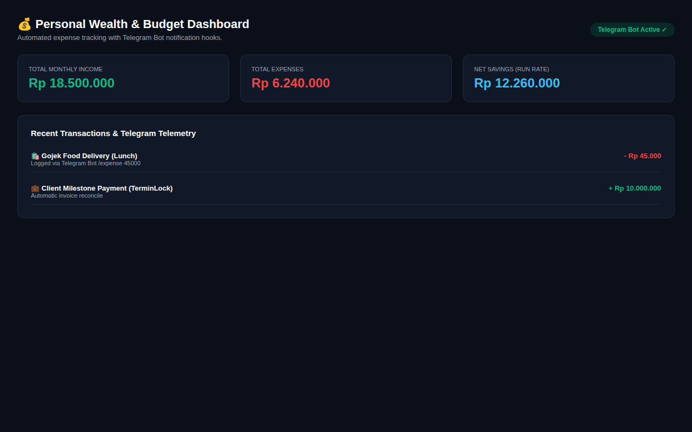
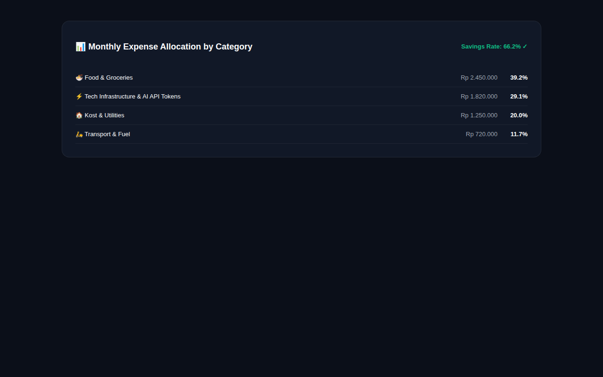

# 💰 WealthTrack — Personal Finance Dashboard & Telegram Bot Hook

> **Automated wealth tracking dashboard with monthly cashflow curves, expense breakdown analytics, and real-time Telegram bot expense ingestion.**

---

## 📸 Visual Showcase & Cashflow Telemetry

  

<em>Figure 1: Monthly Wealth Dashboard with net savings rate, monthly income/expense totals, and Telegram bot status.</em>

 

  <table width="100%">
    <tr>
      <td width="100%" align="center">
        
         <strong>Figure 2: Monthly Expense Allocation by Category</strong> 
        <em>Visual breakdown of Food, Tech Infrastructure, Housing, and Transport expenses.</em>
      </td>
    </tr>
  </table>

